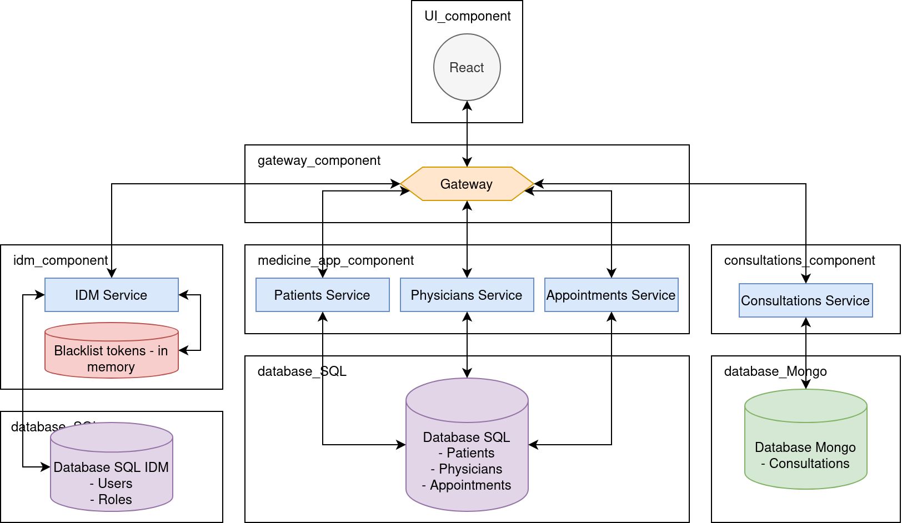

# Medicine Application with REST

The functionalities of this application manage:

- a data collection containing information about patients, physicians, and appointments
- a data set containing the consultations and investigations
- a simple identity management module

# Components

